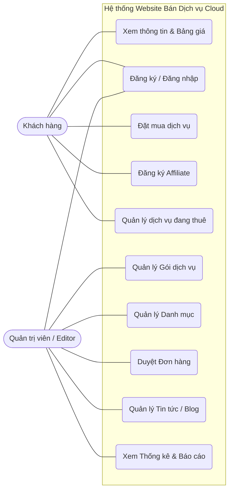
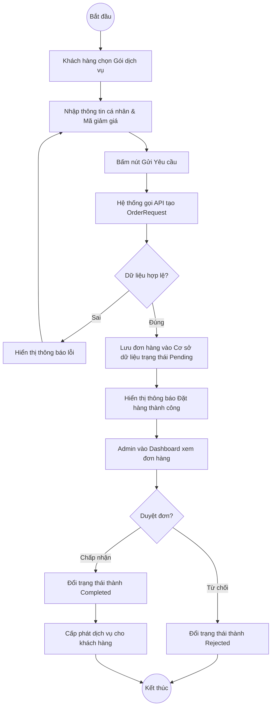
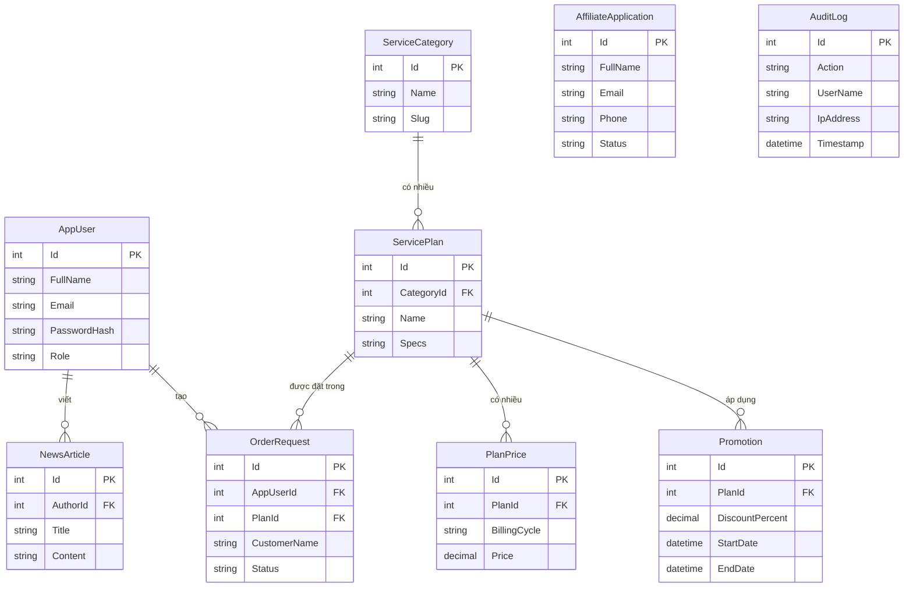
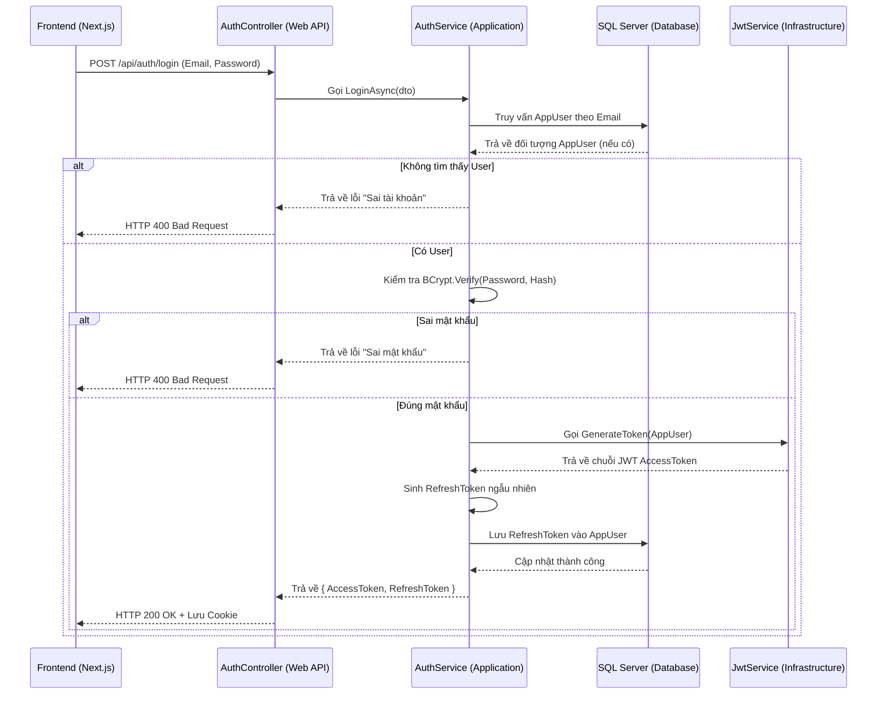

# TẬP HỢP MÃ MERMAID CHO CÁC SƠ ĐỒ

Dưới đây là mã nguồn Mermaid cho 5 sơ đồ được yêu cầu trong báo cáo. 
**Cách sử dụng trên Draw.io:** 
1. Mở trang web [app.diagrams.net](https://app.diagrams.net/) (Draw.io)
2. Chọn menu **Arrange > Insert > Advanced > Mermaid...**
3. Copy đoạn code của từng sơ đồ dưới đây (chỉ copy phần text bên trong, không copy dấu backtick ` ``` `) và dán vào hộp thoại để tự động sinh hình.
4. Export hình ảnh ra định dạng PNG và lưu vào thư mục `images/` với đúng tên file đã ghi.

---

## 1. Sơ đồ Use Case (Tên file: `use_case_diagram.png`)



---

## 2. Sơ đồ Hoạt động Đặt hàng (Tên file: `activity_order.png`)



---

## 3. Sơ đồ Kiến trúc Clean Architecture (Tên file: `clean_architecture.png`)

```mermaid
flowchart TD
    %% Tầng Web API
    subgraph Presentation ["1. Tầng Presentation (Web API)"]
        Controllers[Controllers]
        Middleware[Exception/Audit Middleware]
        DI[Dependency Injection (Program.cs)]
    end

    %% Tầng Infrastructure
    subgraph Infrastructure ["2. Tầng Infrastructure"]
        EFCore[EF Core DbContext]
        Repositories[Repositories & UnitOfWork]
        InfraServices[JWT / BCrypt / QRCoder]
    end

    %% Tầng Application
    subgraph Application ["3. Tầng Application (Use Cases)"]
        AppServices[Logic Nghiệp vụ: OrderService, AuthService...]
        DTOs[Data Transfer Objects (DTO)]
        Interfaces_Svc[Giao diện IService]
    end

    %% Tầng Domain
    subgraph Domain ["4. Tầng Domain (Core)"]
        Entities[Entities: AppUser, OrderRequest...]
        Enums[Enums: UserRole, Status]
        Interfaces_Repo[Giao diện IRepository]
    end

    %% Các mũi tên thể hiện chiều phụ thuộc (Dependency Rule)
    Presentation -.->|Sử dụng| Application
    Presentation -.->|Đăng ký DI| Infrastructure
    
    Infrastructure -.->|Triển khai (Implement)| Domain
    Infrastructure -.->|Lấy DTO/Service| Application
    
    Application -.->|Sử dụng Entity/Interface| Domain
    
    %% Giải thích màu sắc/quy tắc
    classDef core fill:#d4edda,stroke:#28a745,stroke-width:2px;
    class Domain core;
```

---

## 4. Sơ đồ Cơ sở dữ liệu ERD (Tên file: `erd.png`)



---

## 5. Sơ đồ Tuần tự Đăng nhập (Tên file: `sequence_login.png`)


