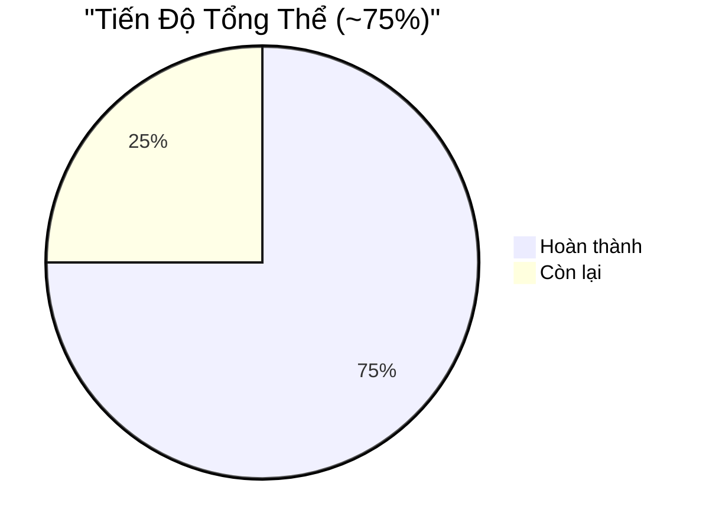
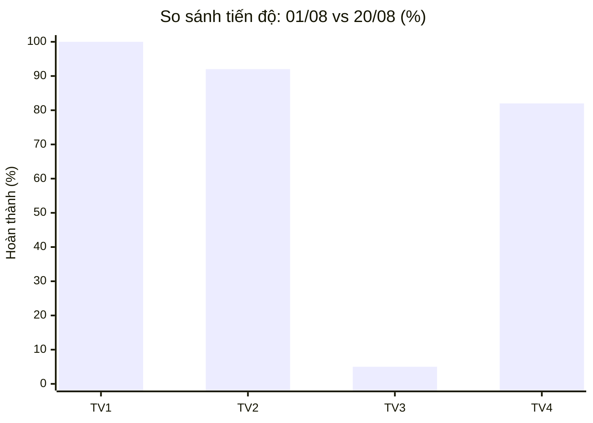

# 📊 Đánh Giá Tiến Độ Dự Án — Ngày 20/08/2026

> **Lần đánh giá trước**: 01/08/2026 (~30%)  
> **Lần đánh giá này**: 20/08/2026  
> **Kế hoạch gốc**: [kehoach](file:///d:/PTPM_huong_doi_tuong/BTL_Ban_dich_vu_cloud/kehoach)

---

## 🎯 Tổng Quan: ~30% → ~75% (+45% trong 19 ngày 🚀)

| Thành phần | 01/08 | 20/08 | Thay đổi |
|---|---|---|---|
| **Domain Layer (TV1)** | 🟢 90% | 🟢 **100%** | ✅ `IAffiliateApplicationRepository` đã bổ sung |
| **Application Layer (TV1)** | 🟡 70% | 🟢 **100%** | ✅ `NewsArticleDto` đã có nội dung |
| **Infrastructure Layer (TV2)** | 🔴 5% | 🟢 **95%** | 🚀 **+90%** — Hoàn thành gần xong |
| **WebApi Layer (TV2)** | 🔴 5% | 🟢 **90%** | 🚀 **+85%** — Controllers + JWT + Swagger |
| **Frontend Admin (TV4)** | 🔴 0% | 🟢 **75%** | 🚀 **+75%** — Dashboard + CRUD + Auth |
| **Frontend Public (TV3)** | 🔴 5% | 🔴 **5%** | ⚠️ **KHÔNG THAY ĐỔI** |
| **Unit Tests (TV4)** | 🔴 0% | 🟢 **100%** | 🚀 **16 test cases** hoàn chỉnh |
| **DevOps (TV4)** | 🔴 5% | 🟢 **85%** | 🚀 Dockerfile + docker-compose + CI |

---

## ✅ Những Gì ĐÃ Hoàn Thành (So với lần trước)

### 🟢 Infrastructure Layer — **HOÀN THÀNH** (TV2)

Từ trống rỗng → đầy đủ:

| File | Trạng thái | Kích thước |
|---|---|---|
| [AppDbContext.cs](file:///d:/PTPM_huong_doi_tuong/BTL_Ban_dich_vu_cloud/backend/CloudService.Infrastructure/Data/AppDbContext.cs) | ✅ FluentAPI + Seed Data | 11,875 bytes |
| [GenericRepository.cs](file:///d:/PTPM_huong_doi_tuong/BTL_Ban_dich_vu_cloud/backend/CloudService.Infrastructure/Repositories/GenericRepository.cs) | ✅ CRUD base | 890 bytes |
| [ServicePlanRepository.cs](file:///d:/PTPM_huong_doi_tuong/BTL_Ban_dich_vu_cloud/backend/CloudService.Infrastructure/Repositories/ServicePlanRepository.cs) | ✅ + Include Prices/Category | 881 bytes |
| [ServiceCategoryRepository.cs](file:///d:/PTPM_huong_doi_tuong/BTL_Ban_dich_vu_cloud/backend/CloudService.Infrastructure/Repositories/ServiceCategoryRepository.cs) | ✅ | 741 bytes |
| [NewsArticleRepository.cs](file:///d:/PTPM_huong_doi_tuong/BTL_Ban_dich_vu_cloud/backend/CloudService.Infrastructure/Repositories/NewsArticleRepository.cs) | ✅ + Phân trang | 959 bytes |
| [OrderRequestRepository.cs](file:///d:/PTPM_huong_doi_tuong/BTL_Ban_dich_vu_cloud/backend/CloudService.Infrastructure/Repositories/OrderRequestRepository.cs) | ✅ + Pending filter | 988 bytes |
| [AffiliateApplicationRepository.cs](file:///d:/PTPM_huong_doi_tuong/BTL_Ban_dich_vu_cloud/backend/CloudService.Infrastructure/Repositories/AffiliateApplicationRepository.cs) | ✅ | 398 bytes |
| [UnitOfWork.cs](file:///d:/PTPM_huong_doi_tuong/BTL_Ban_dich_vu_cloud/backend/CloudService.Infrastructure/Repositories/UnitOfWork.cs) | ✅ | 1,117 bytes |
| [AuthService.cs](file:///d:/PTPM_huong_doi_tuong/BTL_Ban_dich_vu_cloud/backend/CloudService.Infrastructure/Services/AuthService.cs) | ✅ Login + JWT | 1,109 bytes |
| [JwtService.cs](file:///d:/PTPM_huong_doi_tuong/BTL_Ban_dich_vu_cloud/backend/CloudService.Infrastructure/Services/JwtService.cs) | ✅ Token generation | 1,339 bytes |
| [PasswordHashService.cs](file:///d:/PTPM_huong_doi_tuong/BTL_Ban_dich_vu_cloud/backend/CloudService.Infrastructure/Services/PasswordHashService.cs) | ✅ BCrypt | 294 bytes |
| [QrCodeService.cs](file:///d:/PTPM_huong_doi_tuong/BTL_Ban_dich_vu_cloud/backend/CloudService.Infrastructure/Services/QrCodeService.cs) | ✅ QRCoder | 619 bytes |
| [ExcelExportService.cs](file:///d:/PTPM_huong_doi_tuong/BTL_Ban_dich_vu_cloud/backend/CloudService.Infrastructure/Services/ExcelExportService.cs) | ✅ ClosedXML | 1,713 bytes |
| EF Migrations | ✅ `InitialCreate` (11/08/2026) | 3 files |

---

### 🟢 WebApi Layer — **HOÀN THÀNH** (TV2)

Từ template WeatherForecast → API hoàn chỉnh:

| File | Trạng thái |
|---|---|
| [Program.cs](file:///d:/PTPM_huong_doi_tuong/BTL_Ban_dich_vu_cloud/backend/CloudService.WebApi/Program.cs) | ✅ 157 dòng — DI, JWT, CORS, Swagger, Middleware |
| **Public Controllers** (4 files) | |
| [ServiceCategoriesController.cs](file:///d:/PTPM_huong_doi_tuong/BTL_Ban_dich_vu_cloud/backend/CloudService.WebApi/Controllers/Public/ServiceCategoriesController.cs) | ✅ GET categories |
| [ServicePlansController.cs](file:///d:/PTPM_huong_doi_tuong/BTL_Ban_dich_vu_cloud/backend/CloudService.WebApi/Controllers/Public/ServicePlansController.cs) | ✅ GET plans |
| [OrderRequestsController.cs](file:///d:/PTPM_huong_doi_tuong/BTL_Ban_dich_vu_cloud/backend/CloudService.WebApi/Controllers/Public/OrderRequestsController.cs) | ✅ POST orders |
| [AffiliateController.cs](file:///d:/PTPM_huong_doi_tuong/BTL_Ban_dich_vu_cloud/backend/CloudService.WebApi/Controllers/Public/AffiliateController.cs) | ✅ POST affiliate |
| **Admin Controllers** (4 files) | |
| [AuthController.cs](file:///d:/PTPM_huong_doi_tuong/BTL_Ban_dich_vu_cloud/backend/CloudService.WebApi/Controllers/Admin/AuthController.cs) | ✅ POST login |
| [AdminServicePlansController.cs](file:///d:/PTPM_huong_doi_tuong/BTL_Ban_dich_vu_cloud/backend/CloudService.WebApi/Controllers/Admin/AdminServicePlansController.cs) | ✅ CRUD plans |
| [AdminOrdersController.cs](file:///d:/PTPM_huong_doi_tuong/BTL_Ban_dich_vu_cloud/backend/CloudService.WebApi/Controllers/Admin/AdminOrdersController.cs) | ✅ GET/PUT orders |
| [AdminExportController.cs](file:///d:/PTPM_huong_doi_tuong/BTL_Ban_dich_vu_cloud/backend/CloudService.WebApi/Controllers/Admin/AdminExportController.cs) | ✅ Export Excel |
| [ExceptionMiddleware.cs](file:///d:/PTPM_huong_doi_tuong/BTL_Ban_dich_vu_cloud/backend/CloudService.WebApi/Middleware/ExceptionMiddleware.cs) | ✅ Global error handling |

---

### 🟢 Frontend Admin — **CƠ BẢN HOÀN THÀNH** (TV4)

| Trang | File | Trạng thái | Kích thước |
|---|---|---|---|
| Admin Layout | [layout.tsx](file:///d:/PTPM_huong_doi_tuong/BTL_Ban_dich_vu_cloud/frontend/src/app/(admin)/layout.tsx) | ✅ Sidebar + Header + Avatar | 3,937 bytes |
| Login | [login/page.tsx](file:///d:/PTPM_huong_doi_tuong/BTL_Ban_dich_vu_cloud/frontend/src/app/(public)/login/page.tsx) | ✅ Form + JWT cookie + Loading state | 4,794 bytes |
| Dashboard | [dashboard/page.tsx](file:///d:/PTPM_huong_doi_tuong/BTL_Ban_dich_vu_cloud/frontend/src/app/(admin)/dashboard/page.tsx) | ✅ 4 Stats cards + Recharts BarChart | 4,031 bytes |
| CRUD Dịch vụ | [services/page.tsx](file:///d:/PTPM_huong_doi_tuong/BTL_Ban_dich_vu_cloud/frontend/src/app/(admin)/services/page.tsx) | ✅ DataTable + Modal | 4,596 bytes |
| Quản lý Đơn hàng | [orders/page.tsx](file:///d:/PTPM_huong_doi_tuong/BTL_Ban_dich_vu_cloud/frontend/src/app/(admin)/orders/page.tsx) | ✅ DataTable + Status filter | 7,459 bytes |
| Quản lý Affiliate | [affiliates/page.tsx](file:///d:/PTPM_huong_doi_tuong/BTL_Ban_dich_vu_cloud/frontend/src/app/(admin)/affiliates/page.tsx) | ✅ DataTable | 5,266 bytes |
| Auth Middleware | [middleware.ts](file:///d:/PTPM_huong_doi_tuong/BTL_Ban_dich_vu_cloud/frontend/src/middleware.ts) | ✅ Route protection + Redirect logic | 973 bytes |
| Axios Instance | [lib/axios.ts](file:///d:/PTPM_huong_doi_tuong/BTL_Ban_dich_vu_cloud/frontend/src/lib/axios.ts) | ✅ JWT interceptor | 1,020 bytes |
| Design System | [globals.css](file:///d:/PTPM_huong_doi_tuong/BTL_Ban_dich_vu_cloud/frontend/src/app/globals.css) | ✅ Dark theme + CSS variables + Custom scrollbar | 2,061 bytes |

**Dependencies cài đặt**: `axios`, `recharts`, `lucide-react`, `@tiptap/*`, `js-cookie` ✅

---

### 🟢 Unit Tests — **HOÀN THÀNH** (TV4)

| File Test | Số [Fact] | Trạng thái |
|---|---|---|
| [ServicePlanServiceTests.cs](file:///d:/PTPM_huong_doi_tuong/BTL_Ban_dich_vu_cloud/backend/CloudService.UnitTests/Tests/ServicePlanServiceTests.cs) | **5** | ✅ |
| [OrderServiceTests.cs](file:///d:/PTPM_huong_doi_tuong/BTL_Ban_dich_vu_cloud/backend/CloudService.UnitTests/Tests/OrderServiceTests.cs) | **6** | ✅ |
| [CategoryServiceTests.cs](file:///d:/PTPM_huong_doi_tuong/BTL_Ban_dich_vu_cloud/backend/CloudService.UnitTests/Tests/CategoryServiceTests.cs) | **2** | ✅ |
| [AffiliateServiceTests.cs](file:///d:/PTPM_huong_doi_tuong/BTL_Ban_dich_vu_cloud/backend/CloudService.UnitTests/Tests/AffiliateServiceTests.cs) | **2** | ✅ |
| [NewsArticleServiceTests.cs](file:///d:/PTPM_huong_doi_tuong/BTL_Ban_dich_vu_cloud/backend/CloudService.UnitTests/Tests/NewsArticleServiceTests.cs) | **1** | ✅ |
| **Tổng** | **16** | ✅ ≥15 theo yêu cầu |

---

### 🟢 DevOps — **HOÀN THÀNH** (TV4)

| File | Trạng thái | Ghi chú |
|---|---|---|
| [Dockerfile](file:///d:/PTPM_huong_doi_tuong/BTL_Ban_dich_vu_cloud/backend/Dockerfile) | ✅ Multi-stage build (SDK → Runtime) | 29 dòng |
| [docker-compose.yml](file:///d:/PTPM_huong_doi_tuong/BTL_Ban_dich_vu_cloud/docker-compose.yml) | ✅ SQL Server + Backend API | 34 dòng |
| [ci.yml](file:///d:/PTPM_huong_doi_tuong/BTL_Ban_dich_vu_cloud/.github/workflows/ci.yml) | ✅ Build + Test on push/PR | 33 dòng |

---

## ❌ Những Gì CHƯA Hoàn Thành

### 🔴 Frontend Public (TV3) — **0/8 trang** — CRITICAL

> [!CAUTION]
> **Đây là vấn đề nghiêm trọng nhất.** Trang chủ [page.tsx](file:///d:/PTPM_huong_doi_tuong/BTL_Ban_dich_vu_cloud/frontend/src/app/page.tsx) vẫn là **template mặc định Next.js** ("To get started, edit the page.tsx file."). Không có bất kỳ trang công khai nào được làm.

| Trang | Route | Trạng thái |
|---|---|---|
| Trang chủ (Hero, Services, Promotions) | `/` | ❌ Template mặc định |
| Trang Giới thiệu | `/gioi-thieu` | ❌ Chưa tạo |
| Trang Dịch vụ | `/dich-vu` | ❌ Chưa tạo |
| Chi tiết dịch vụ | `/dich-vu/[slug]` | ❌ Chưa tạo |
| Trang Bảng giá | `/bang-gia` | ❌ Chưa tạo |
| Trang Tin tức | `/tin-tuc` | ❌ Chưa tạo |
| Trang Liên hệ / Đặt DV | `/lien-he` | ❌ Chưa tạo |
| Trang Đối tác | `/doi-tac` | ❌ Chưa tạo |

### 🟡 Frontend Admin — Còn thiếu

| Trang | Trạng thái |
|---|---|
| CRUD Tin tức (Rich Text Editor) | ❌ Chưa có |
| Thống kê (Chart.js/Recharts PieChart) | ⚠️ Dashboard có BarChart nhưng chưa có trang riêng |
| Audit Log UI | ❌ Chưa có |
| Export Excel button trên UI | ❌ Controller có nhưng UI chưa kết nối |

### 🟡 Backend — Nhỏ

| Thiếu | Ghi chú |
|---|---|
| `AdminNewsController` | Chưa có controller CRUD cho News ở Admin |
| `AdminStatsController` | Chưa có thống kê API |
| `AuditLogsController` | Chưa có |
| `AuditMiddleware` | Chỉ có `ExceptionMiddleware`, chưa có audit log middleware |
| `NewsArticlesController` (Public GET) | Controller public cho news chưa có |

---

## 📊 Tiến Độ Theo Thành Viên

| Thành viên | 01/08 | 20/08 | Đánh giá |
|---|---|---|---|
| **TV1** (Domain + App) | 80% | **100%** | ✅ Hoàn thành xuất sắc từ sớm |
| **TV2** (Infra + WebApi) | 5% | **~92%** | 🚀 Tiến bộ vượt bậc! Còn thiếu vài controller |
| **TV3** (FE Public) | 5% | **~5%** | 🔴 **Không tiến bộ — cần hành động ngay!** |
| **TV4** (FE Admin + DevOps + Tests) | 3% | **~82%** | 🚀 Tiến bộ lớn! Dashboard + Tests + Docker |

---

## 📈 Ước Tính Điểm Số Hiện Tại

| Tiêu chí | Điểm max | 01/08 | 20/08 | Ghi chú |
|---|---|---|---|---|
| Clean Architecture + SOLID + Patterns | 20 | ~12 | **~18** | ✅ Repository, UoW, Result, Factory patterns |
| Backend API đầy đủ, REST, ORM | 20 | ~3 | **~16** | ✅ 8 controllers, EF Core, JWT. Thiếu vài endpoint |
| Frontend đầy đủ, responsive | 15 | ~0 | **~5** | ⚠️ Admin OK nhưng **Public = 0** |
| Bảo mật: JWT + role + hash + QR | 10 | ~0 | **~9** | ✅ JWT + BCrypt + Role-based + QR Code |
| Unit Testing ≥15 tests | 10 | ~0 | **~10** | ✅ 16 test cases |
| Git + CI/CD + Docker | 10 | ~1 | **~8** | ✅ Dockerfile + compose + CI pipeline |
| Báo cáo + demo | 10 | ~0 | **~2** | ⚠️ Có `bao_cao_tv4.md` nhưng chưa đầy đủ |
| **Tổng** | **95** | **~16** | **~68** | **+52 điểm trong 19 ngày** |
| Deploy cloud (bonus) | +5 | 0 | 0 | Chưa deploy |

> [!WARNING]
> **Nếu nộp ngay**: ước tính **~68/95 điểm** (~72%). Thiếu điểm chủ yếu ở **Frontend Public (TV3)** — mất ~10 điểm và ấn tượng demo.

---

## ⚡ Ưu Tiên Khẩn Cấp

### 🔴 #1: TV3 — Frontend Public (KHẨN CẤP)
TV3 cần **ngay lập tức** bắt tay vào:
1. **Trang chủ** — Hero banner, danh mục dịch vụ, CTA
2. **Trang Dịch vụ** — Grid danh mục + trang chi tiết
3. **Trang Bảng giá** — Toggle tháng/năm
4. **Trang Liên hệ** — Form đặt dịch vụ

> Tối thiểu 4 trang để có cái nhìn tổng thể khi demo.

### 🟡 #2: Backend — Bổ sung controllers thiếu
- `AdminNewsController` (CRUD tin tức)
- `NewsArticlesController` (Public GET + phân trang)
- `AdminStatsController` (thống kê cho Dashboard)

### 🟡 #3: Frontend Admin — Bổ sung
- Trang CRUD Tin tức (đã có TipTap dependency)
- Kết nối Export Excel button
- Audit Log UI (nếu có thời gian)

### 🟢 #4: Hoàn thiện
- README hoàn chỉnh
- Báo cáo tổng hợp
- Test `docker compose up` trên máy sạch

---

## 📋 Tóm Tắt So Sánh 01/08 → 20/08

| Metric | 01/08 | 20/08 | Δ |
|---|---|---|---|
| **Tổng tiến độ** | ~30% | ~75% | **+45%** 🚀 |
| **Files code backend** | ~35 files | ~55 files | +20 files |
| **Files code frontend** | ~4 files | ~15 files | +11 files |
| **Unit tests** | 0 | 16 | +16 |
| **Docker files** | 0 (trống) | 2 (hoàn chỉnh) | +2 |
| **CI pipeline** | 0 (trống) | 1 (hoạt động) | +1 |
| **Ước tính điểm** | ~16/95 | ~68/95 | **+52** |
