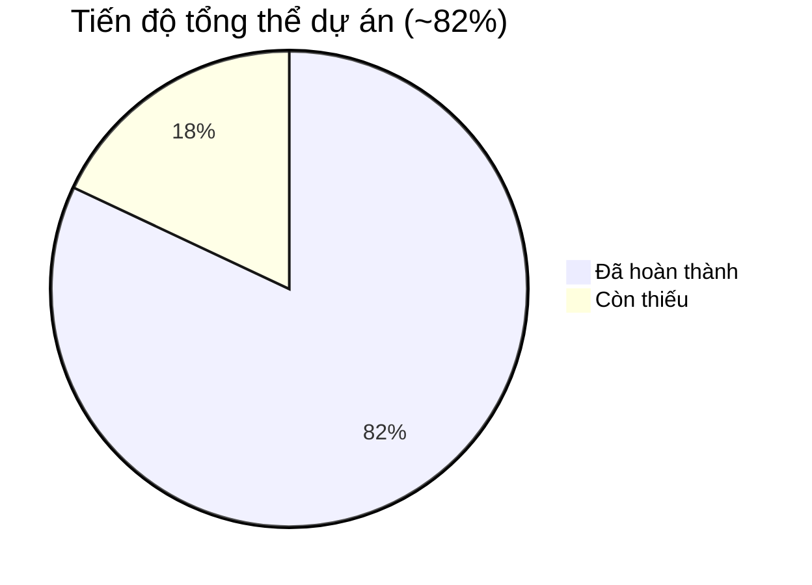

# 📊 ĐÁNH GIÁ TIẾN ĐỘ DỰ ÁN — 22/08/2026

> Đối chiếu với [de-bai-tap-lon-cuoi-ky.md](file:///d:/PTPM_huong_doi_tuong/BTL_Ban_dich_vu_cloud/de-bai-tap-lon-cuoi-ky.md) và [kế hoạch đã đề ra](file:///d:/PTPM_huong_doi_tuong/BTL_Ban_dich_vu_cloud/kehoach).

---

## 1. TỔNG QUAN TIẾN ĐỘ

| Hạng mục | Tiến độ | Ghi chú |
|---|---|---|
| **Backend API (TV2)** | 🟡 **~80%** | Thiếu Refresh Token, Change Password, Promotions CRUD |
| **Frontend Public (TV3)** | 🟢 **~92%** | 8/8 trang + 2 bonus, API kết nối một phần |
| **Frontend Admin (TV4)** | 🟢 **~85%** | 7 trang admin + sidebar + dashboard đẹp |
| **Unit Testing (TV1)** | ✅ **100%** | 16 test cases ≥ 15 yêu cầu |
| **CI/CD + Docker (TV1)** | 🟡 **~75%** | CI ✅, Dockerfile ✅, docker-compose ✅, nhưng README trống |
| **Báo cáo + Slides** | ❌ **~0%** | Chưa có báo cáo PDF hay slides |

---

## 2. ĐỐI CHIẾU TỪNG TIÊU CHÍ CHẤM ĐIỂM

### 2.1 Kiến trúc Clean Architecture + SOLID + Design Patterns (20 điểm)

| Yêu cầu | Hiện trạng | Đạt? |
|---|---|---|
| Clean Architecture 4 tầng | ✅ Domain → Application → Infrastructure → WebApi | ✅ |
| SOLID principles | ✅ Interface segregation (9 interfaces), DI | ✅ |
| Repository Pattern | ✅ `GenericRepository` + 7 repos cụ thể + `UnitOfWork` | ✅ |
| Design Patterns | ✅ Unit of Work, Middleware (AuditMiddleware, ExceptionMiddleware) | ✅ |
| **Điểm ước tính** | | **~17/20** |

> [!NOTE]
> Cần giải thích rõ trong báo cáo: design patterns đã dùng (Repository, UoW, Middleware, Strategy cho auth/hash) kèm trích code.

---

### 2.2 Backend API: đầy đủ chức năng, REST, ORM (20 điểm)

#### Mô hình dữ liệu (Entity)

| Entity yêu cầu (đề bài 3.3) | Có? | File |
|---|---|---|
| `ServiceCategory` | ✅ | `Domain/Entities/ServiceCategory.cs` |
| `ServicePlan` | ✅ | `Domain/Entities/ServicePlan.cs` |
| `PlanPrice` | ✅ | `Domain/Entities/PlanPrice.cs` |
| `Promotion` | ✅ | `Domain/Entities/Promotion.cs` |
| `NewsArticle` | ✅ | `Domain/Entities/NewsArticle.cs` |
| `OrderRequest` | ✅ | `Domain/Entities/OrderRequest.cs` |
| `AffiliateApplication` | ✅ | `Domain/Entities/AffiliateApplication.cs` |
| `AppUser` | ✅ | `Domain/Entities/AppUser.cs` |
| `Role` (Enum) | ✅ | `Domain/Enums/UserRole.cs` |
| `AuditLog` | ✅ | `Domain/Entities/AuditLog.cs` |
| **Kết quả** | **10/10** entity | ✅ |

#### API Controllers

| # | Controller | Route | Chức năng | Đạt? |
|---|---|---|---|---|
| **Public** |
| 1 | `ServiceCategoriesController` | `api/public/categories` | GET danh mục | ✅ |
| 2 | `ServicePlansController` | `api/public/plans` | GET gói dịch vụ | ✅ |
| 3 | `NewsArticlesController` | `api/public/news` | GET tin tức + slug | ✅ |
| 4 | `OrderRequestsController` | `api/public/orders` | POST đặt dịch vụ | ✅ |
| 5 | `AffiliateController` | `api/public/affiliates` | POST đăng ký affiliate | ✅ |
| **Admin** |
| 6 | `AuthController` | `api/auth/login` | POST login → JWT | ✅ |
| 7 | `AdminCategoriesController` | `api/admin/categories` | CRUD danh mục | ✅ |
| 8 | `AdminServicePlansController` | `api/admin/plans` | CRUD gói (GET/POST/PUT/DELETE) | ✅ |
| 9 | `AdminNewsController` | `api/admin/news` | CRUD tin tức | ✅ |
| 10 | `AdminOrdersController` | `api/admin/orders` | GET + đổi trạng thái | ✅ |
| 11 | `AdminAffiliatesController` | `api/admin/affiliates` | GET + đổi trạng thái | ✅ |
| 12 | `AdminStatsController` | `api/admin/stats` | Thống kê | ✅ |
| 13 | `AdminExportController` | `api/admin/export` | Xuất Excel | ✅ |
| 14 | `AuditLogsController` | `api/admin/audit-logs` | GET audit logs | ✅ |

#### ❌ CÁC CHỨC NĂNG BACKEND CÒN THIẾU

| # | Yêu cầu đề bài | Hiện trạng | Mức nghiêm trọng |
|---|---|---|---|
| 1 | **Refresh Token** (mục 3.2 #1) | ❌ Chỉ có `Login → token`, không có endpoint refresh | 🔴 **CAO** |
| 2 | **Đổi mật khẩu** (mục 3.2 #1) | ❌ Không có `POST /auth/change-password` | 🔴 **CAO** |
| 3 | **CRUD Promotion/Khuyến mãi** (mục 3.2 #2) | ❌ Entity `Promotion` tồn tại nhưng **không có Controller/Service** | 🔴 **CAO** |
| 4 | **Sinh QR cho từng gói** (mục 3.2 #3) | 🟡 Có `QrCodeService` nhưng chưa tích hợp vào `ServicePlanController` | 🟡 TB |
| 5 | **Serilog logging** (mục 2.3 điểm cộng) | ❌ Không tìm thấy cấu hình Serilog trong `Program.cs` | 🟡 TB |

| **Điểm ước tính** | **~15/20** |
|---|---|

---

### 2.3 Frontend: đầy đủ chức năng, responsive (15 điểm)

#### Trang công khai (Landing Page) — Đề bài mục 3.1

| # | Yêu cầu | Trang | File | Đạt? |
|---|---|---|---|---|
| 1 | Trang chủ (Hero, dịch vụ, khuyến mãi, cam kết, tin mới) | ✅ | `(public)/page.tsx` — 233 dòng | ✅ |
| 2 | Giới thiệu (lịch sử, hạ tầng, SLA) | ✅ | `(public)/gioi-thieu/page.tsx` — 149 dòng | ✅ |
| 3 | Dịch vụ (danh mục + thông số) | ✅ | `(public)/dich-vu/page.tsx` + `[slug]/page.tsx` | ✅ |
| 4 | Bảng giá (so sánh gói, chu kỳ tháng/năm, khuyến mãi) | ✅ | `(public)/bang-gia/page.tsx` — toggle tháng/năm | ✅ |
| 5 | Khách hàng (testimonial, logo, **mã QR**) | ⚠️ | Homepage có Testimonials nhưng **thiếu trang riêng `/khach-hang`** và **thiếu QR code** | 🟡 |
| 6 | Tin tức / Blog (danh sách + chi tiết, tìm kiếm, phân loại) | ✅ | `(public)/tin-tuc/page.tsx` + `[slug]/page.tsx` | ✅ |
| 7 | Liên hệ / Đặt dịch vụ (form, chọn gói, lưu DB) | ✅ | `(public)/lien-he/page.tsx` → API | ✅ |
| 8 | Đối tác / Affiliate (thông tin + form đăng ký) | ✅ | `(public)/doi-tac/page.tsx` → API | ✅ |
| **Bonus** | Đăng nhập + Đăng ký | ✅ | `dang-nhap/page.tsx` + `dang-ky/page.tsx` | ✅ |

#### Trang quản trị (Admin) — Đề bài mục 3.2

| # | Yêu cầu | Trang | File | Đạt? |
|---|---|---|---|---|
| 1 | Đăng nhập JWT | ✅ | `(public)/login/page.tsx` — gọi API, lưu cookie | ✅ |
| 2 | CRUD gói dịch vụ + bảng giá/khuyến mãi | ⚠️ | `admin/services/page.tsx` — **chưa có CRUD khuyến mãi** | 🟡 |
| 3 | CRUD danh mục dịch vụ + sinh QR | ⚠️ | `admin/services/page.tsx` — **chưa hiển thị QR** | 🟡 |
| 4 | CRUD tin tức/blog | ✅ | `admin/news/page.tsx` | ✅ |
| 5 | Quản lý yêu cầu đặt + affiliate (xem, đổi trạng thái) | ✅ | `admin/orders/page.tsx` + `admin/affiliates/page.tsx` | ✅ |
| 6 | Thống kê biểu đồ | ✅ | `admin/analytics/page.tsx` | ✅ |
| 7 | Xuất Excel | ⚠️ | Backend có API, **frontend chưa có nút bấm gọi export** | 🟡 |
| 8 | Audit log | ✅ | `admin/audit-logs/page.tsx` | ✅ |

#### Responsive + Layout

| Tiêu chí | Đạt? |
|---|---|
| Desktop layout | ✅ |
| Mobile responsive | ✅ Hamburger menu hoạt động |
| Header + Footer | ✅ |
| Admin sidebar layout | ✅ |
| SEO metadata | ✅ Root layout (title, description, OpenGraph, `lang="vi"`) |

| **Điểm ước tính** | **~12/15** |
|---|---|

---

### 2.4 Bảo mật: JWT + role, hash password, QR code (10 điểm)

| Yêu cầu | Hiện trạng | Đạt? |
|---|---|---|
| JWT authentication | ✅ `JwtService.cs` — tạo token từ `AppUser` | ✅ |
| Refresh Token | ❌ **Không có** — chỉ có login trả access token | ❌ |
| Phân quyền Role (≥ 2 roles) | ✅ `[Authorize(Roles = "Admin")]`, `"Admin,Editor"` | ✅ |
| Password hash Bcrypt | ✅ `BCrypt.Net.BCrypt.HashPassword()` + `Verify()` | ✅ |
| Sinh mã QR cho gói dịch vụ | 🟡 `QrCodeService` tồn tại, **chưa tích hợp vào endpoint** | 🟡 |

| **Điểm ước tính** | **~7/10** |
|---|---|

---

### 2.5 Unit Testing ≥ 15 tests, có coverage (10 điểm)

| File test | Số `[Fact]` | Đối tượng test |
|---|---|---|
| `OrderServiceTests.cs` | 6 | OrderService CRUD + status |
| `ServicePlanServiceTests.cs` | 5 | ServicePlan CRUD |
| `AffiliateServiceTests.cs` | 2 | Affiliate create + status |
| `CategoryServiceTests.cs` | 2 | Category CRUD |
| `NewsArticleServiceTests.cs` | 1 | NewsArticle |
| **Tổng** | **16** | ≥ 15 ✅ |

| Tiêu chí | Đạt? |
|---|---|
| ≥ 15 test cases | ✅ 16 tests |
| xUnit framework | ✅ |
| Moq (mock) | ✅ |
| Coverage report | ❌ **Chưa sinh báo cáo coverage** |

| **Điểm ước tính** | **~8/10** |
|---|---|

---

### 2.6 Git teamwork + CI/CD + Docker (10 điểm)

| Yêu cầu | Hiện trạng | Đạt? |
|---|---|---|
| GitHub repo | ✅ | ✅ |
| Feature branch + PR merge | ⚠️ Cần kiểm tra lịch sử PR trên GitHub | ❓ |
| ≥ 10 PR | ⚠️ Cần kiểm tra trên GitHub | ❓ |
| Commit đều của tất cả thành viên | ⚠️ Cần kiểm tra | ❓ |
| CI — GitHub Actions (build + test) | ✅ `ci.yml` — build + test tự động | ✅ |
| Dockerfile cho API | ✅ `backend/Dockerfile` | ✅ |
| `docker-compose.yml` (API + SQL Server) | ✅ 2 services: `sqldb` + `backend` | ✅ |
| `docker compose up` chạy được | ⚠️ **Chưa test** — cần test trên máy sạch | ❓ |
| README hướng dẫn chạy | ❌ **README trống** (0 bytes!) | ❌ |

> [!CAUTION]
> **README.md đang trống!** Đề bài yêu cầu: "README: mô tả kiến trúc, hướng dẫn chạy (`docker compose up` phải chạy được), tài khoản demo". Đây là **quy định trừ điểm**: `docker compose up` không chạy được → **-10 điểm**.

| **Điểm ước tính** | **~6/10** (phụ thuộc vào PR count và README) |
|---|---|

---

### 2.7 Báo cáo + Thuyết trình (10 điểm)

| Yêu cầu | Hiện trạng | Đạt? |
|---|---|---|
| Báo cáo PDF 15-25 trang | ❌ **Chưa có** | ❌ |
| ERD (sơ đồ quan hệ dữ liệu) | ❌ | ❌ |
| Sơ đồ kiến trúc Clean Architecture | ❌ | ❌ |
| Design Patterns trích code | ❌ | ❌ |
| Ảnh chụp màn hình | ❌ | ❌ |
| Phân công công việc | ✅ Có trong các file `ke_hoach_tv*.md` | ✅ |
| Kết quả test coverage | ❌ | ❌ |
| Slides + Demo trực tiếp | ❌ **Chưa có** | ❌ |

| **Điểm ước tính** | **~0/10** |
|---|---|

---

## 3. BẢNG TỔNG HỢP ĐIỂM ƯỚC TÍNH

| Tiêu chí | Điểm tối đa | Điểm ước tính | Ghi chú |
|---|---|---|---|
| Clean Architecture + SOLID + Patterns | 20 | **~17** | Tốt, cần giải thích trong báo cáo |
| Backend API | 20 | **~15** | Thiếu Refresh Token, ChangePassword, Promotions CRUD |
| Frontend | 15 | **~12** | Thiếu trang Khách hàng, QR, CRUD khuyến mãi Admin |
| Bảo mật | 10 | **~7** | Thiếu Refresh Token, QR chưa tích hợp |
| Unit Testing | 10 | **~8** | 16 tests ✅, thiếu coverage report |
| Git + CI/CD + Docker | 10 | **~6** | README trống! |
| Báo cáo + Thuyết trình | 10 | **~0** | ❌ Chưa làm |
| Vấn đáp | 5 | — | Tùy vào buổi demo |
| **Tổng** | **100** | **~65/100** | **Quy về thang 10: ~6.5** |
| **Điểm cộng deploy** | +5 | 0 | Chưa deploy |

> [!WARNING]
> **Nếu README trống và `docker compose up` lỗi** → bị trừ thêm **10 điểm** (quy định đề bài 5.1). Tức chỉ còn **~55/100**.

---

## 4. DANH SÁCH VIỆC CẦN LÀM KHẨN CẤP

### 🔴 ƯU TIÊN CAO — Ảnh hưởng trực tiếp đến điểm

| # | Việc | Người | Ước lượng | Ảnh hưởng điểm |
|---|---|---|---|---|
| 1 | **Viết README.md** (kiến trúc + `docker compose up` + tài khoản demo) | TV1 | 1 giờ | +2-3 điểm, **tránh bị -10** |
| 2 | **Thêm Refresh Token endpoint** (`POST /auth/refresh`) | TV2 | 2-3 giờ | +2-3 điểm |
| 3 | **Thêm ChangePassword endpoint** (`POST /auth/change-password`) | TV2 | 1 giờ | +1 điểm |
| 4 | **CRUD Promotion** (Controller + Service cho Khuyến mãi) | TV2 | 2-3 giờ | +2 điểm |
| 5 | **Viết Báo cáo PDF** (15-25 trang: ERD, kiến trúc, patterns, screenshots) | Tất cả | 1-2 ngày | **+10 điểm** |
| 6 | **Tạo Slides + chuẩn bị Demo** (15 phút) | Tất cả | 3-4 giờ | +10 điểm |

### 🟡 ƯU TIÊN TB — Cải thiện điểm

| # | Việc | Người | Ước lượng |
|---|---|---|---|
| 7 | Tích hợp QR Code vào endpoint `/plans` hoặc trang admin | TV2+TV4 | 1-2 giờ |
| 8 | Trang `/khach-hang` (testimonial + QR từng gói) | TV3 | 2-3 giờ |
| 9 | Frontend admin: thêm CRUD Khuyến mãi + nút Export Excel | TV4 | 2-3 giờ |
| 10 | Sinh coverage report (`dotnet test --collect:"XPlat Code Coverage"`) | TV1 | 30 phút |
| 11 | Test `docker compose up` trên máy sạch — sửa lỗi nếu có | TV1 | 1-2 giờ |
| 12 | Kiểm tra PR ≥ 10 trên GitHub, bổ sung nếu thiếu | Tất cả | 1 giờ |

### 🟢 ĐIỂM CỘNG (Nếu còn thời gian)

| # | Việc | Người | Điểm cộng |
|---|---|---|---|
| 13 | Cấu hình Serilog logging | TV2 | +1-2 |
| 14 | Deploy lên VPS/Azure + cung cấp link chạy được | TV1 | **+5** |

---

## 5. ƯỚC LƯỢNG ĐIỂM NẾU HOÀN THÀNH HẾT

| Kịch bản | Điểm | Thang 10 |
|---|---|---|
| **Hiện tại** (chưa làm báo cáo/slides) | ~65 | 6.5 |
| **Nếu README trống + docker lỗi** | ~55 | 5.5 |
| **Hoàn thành #1-6** (README + Refresh + Promotion + Báo cáo + Slides) | ~85 | 8.5 |
| **Hoàn thành #1-12** (tất cả ưu tiên TB) | ~92 | 9.2 |
| **Hoàn thành tất cả + deploy** | ~97 | 9.7 |

---

## 6. PHÂN CÔNG CỤ THỂ

### TV1 (Team Lead / DevOps):
- [ ] 🔴 Viết README.md chi tiết
- [ ] 🟡 Test docker compose up trên máy sạch
- [ ] 🟡 Sinh coverage report
- [ ] 🟢 Deploy lên cloud

### TV2 (Backend):
- [ ] 🔴 Thêm `POST /auth/refresh` (Refresh Token)
- [ ] 🔴 Thêm `POST /auth/change-password`
- [ ] 🔴 Tạo `PromotionsController` + `PromotionService` (CRUD)
- [ ] 🟡 Tích hợp QR vào endpoint `/plans/{id}/qr`
- [ ] 🟢 Cấu hình Serilog

### TV3 (Frontend Public):
- [ ] 🟡 Tạo trang `/khach-hang` (testimonials + QR mỗi gói)
- [ ] 🟡 Fetch dữ liệu API thật cho Trang chủ + Dịch vụ + Bảng giá

### TV4 (Frontend Admin):
- [ ] 🟡 Thêm tab CRUD Khuyến mãi (admin/promotions)
- [ ] 🟡 Nút Export Excel cho trang Orders
- [ ] 🟡 Hiển thị QR Code trong trang quản lý dịch vụ

### Tất cả:
- [ ] 🔴 Viết Báo cáo PDF (15-25 trang)
- [ ] 🔴 Tạo Slides + chuẩn bị Demo
- [ ] 🟡 Kiểm tra ≥ 10 PR trên GitHub
