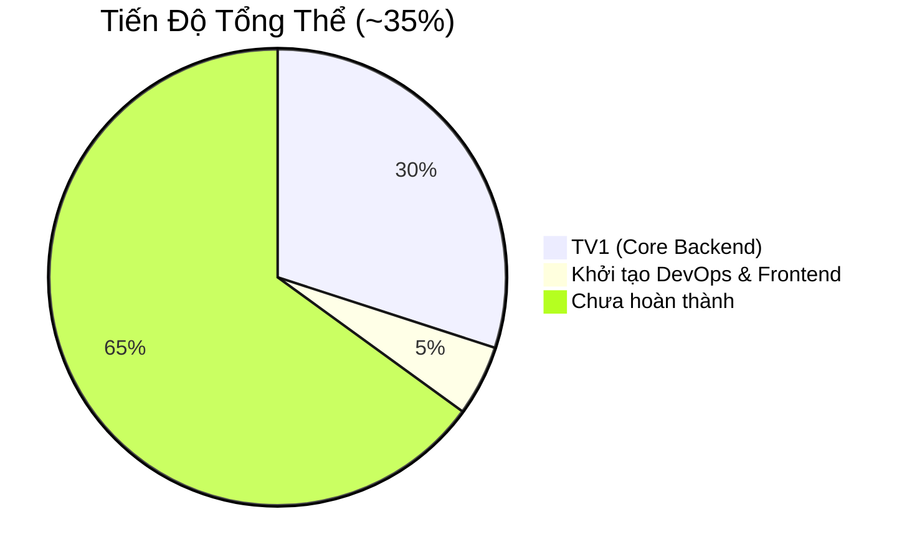

# 📊 Báo Cáo Tiến Độ Dự Án – Website Bán Dịch Vụ Cloud

> **Cập nhật lần cuối**: 01/08/2026 (Theo giờ local)  
> **Tham chiếu Kế hoạch gốc**: [kehoach](file:///d:/BTL_Ban_dich_vu_cloud/kehoach)

---

## 🎯 Tổng Quan Tiến Độ Dự Án

| Phụ trách | Tầng / Nhiệm vụ | Tiến độ | Trạng thái |
|---|---|---|---|
| **TV1 (Leader)** | **Domain & Application Layer** | 🟢 **100%** | **Đã hoàn thành xuất sắc.** Bàn giao Auth/AuditLog cho TV2. |
| **TV2** | **Infrastructure & WebApi Layer** | 🟡 **5%** | Sắp bắt đầu. Cần setup DB, Security & Controllers. |
| **TV3** | **Frontend (Trang công khai)** | 🟡 **5%** | Đã có khung Next.js. Chờ bắt tay vào UI. |
| **TV4** | **Frontend (Admin) & DevOps** | 🟡 **10%** | Đã có Docker/CI template. Chờ ráp code và viết Unit Tests. |

---

## 📋 Ghi Nhận Công Việc Đã Hoàn Thành (TV1)

**Tầng Domain (Hoàn tất 100%):**
- [x] Tạo đủ 9 Entities theo ERD (`ServiceCategory`, `ServicePlan`, `PlanPrice`, `Promotion`, `NewsArticle`, `OrderRequest`, `AppUser`, `AuditLog`, `AffiliateApplication`).
- [x] Tạo BaseEntity chuẩn hóa `Id` (Guid) và Timestamp.
- [x] Cấu hình 3 Enum (`BillingCycle`, `OrderStatus`, `UserRole`).
- [x] Áp dụng Design Pattern: Khởi tạo Interface cho `IGenericRepository` và `IUnitOfWork`.
- [x] Bổ sung *Result Pattern* (`Result.cs`) hỗ trợ trả về logic mượt mà.

**Tầng Application (Hoàn tất 100% phần Core):**
- [x] Viết DTOs, Mappings, Interfaces và Services cho 5 luồng nghiệp vụ lõi: 
  - Gói Dịch vụ (`ServicePlan`)
  - Đơn Hàng (`OrderRequest`)
  - Danh mục (`ServiceCategory`)
  - Tin tức (`NewsArticle`)
  - Đăng ký Đối tác (`AffiliateApplication`)
- [x] **Quyết định Leader (Tối ưu dự án):** Bàn giao 3 tính năng râu ria/hạ tầng là `AuthService` (Đăng nhập), `AuditLog` (Ghi nhật ký) và `FluentValidation` (Kiểm tra dữ liệu) cho TV2 xử lý đồng bộ tại tầng API & Infrastructure.

---

## 🚀 Kế Hoạch Tiếp Theo Cho Các Thành Viên (TV2, TV3, TV4)

### 👉 Nhiệm vụ của TV2 (Backend API + Security)
Tiếp nhận kiến trúc từ TV1, TV2 cần bắt tay vào làm tầng `CloudService.Infrastructure` và `CloudService.WebApi`:
1. **Thiết lập Database:** Cài đặt `EF Core SQL Server`, viết `AppDbContext` chứa các `DbSet`, viết cấu hình FluentAPI cho các bảng và chạy Migration.
2. **Triển khai Pattern:** Viết code thực sự cho `GenericRepository` và `UnitOfWork` (Kế thừa từ interface TV1 đã làm).
3. **Bảo mật (Được TV1 giao phó):** Cài đặt `BCrypt` để băm mật khẩu, triển khai `JwtService` để tạo token đăng nhập.
4. **Log Hệ thống:** Ghi đè hàm `SaveChangesAsync` trong `AppDbContext` để tự động ghi log vào bảng `AuditLog` (Dùng EF Core Interceptor).
5. **WebApi Controller:** Tạo các Controller REST API, áp dụng `FluentValidation` để check lỗi request trước khi gọi xuống tầng Application của TV1.

### 👉 Nhiệm vụ của TV3 (Frontend Public)
Xây dựng giao diện hướng khách hàng trên khung Next.js đã có sẵn:
1. **Thiết lập Design System:** Set up TailwindCSS colors, Typography (chọn font hiện đại), Header/Footer layout.
2. **Landing Page:** Code trang chủ có hiệu ứng (Hero banner, Bảng giá, Khuyến mãi).
3. **Trang động (Dynamic Routes):** Gọi fetch/axios để lấy dữ liệu từ WebApi của TV2 hiển thị ra Trang Dịch vụ, Blog và Form Liên hệ đặt hàng.

### 👉 Nhiệm vụ của TV4 (Frontend Admin + DevOps + Testing)
1. **Trang Quản Trị (Admin):** Dựng Layout Dashboard, làm luồng Login (lưu JWT token), code các bảng CRUD dịch vụ và thay đổi trạng thái Đơn hàng.
2. **DevOps:** Hoàn thiện file `docker-compose.yml` (để chạy chung cả SQL Server và Backend), ráp lệnh vào GitHub Actions `.github/workflows/ci.yml`.
3. **Unit Tests:** Viết tối thiểu 15 Test cases bằng `xUnit` và `Moq` nhắm vào các Service của TV1 (Ví dụ test `OrderService` xem nó có set đúng trạng thái mặc định không).
